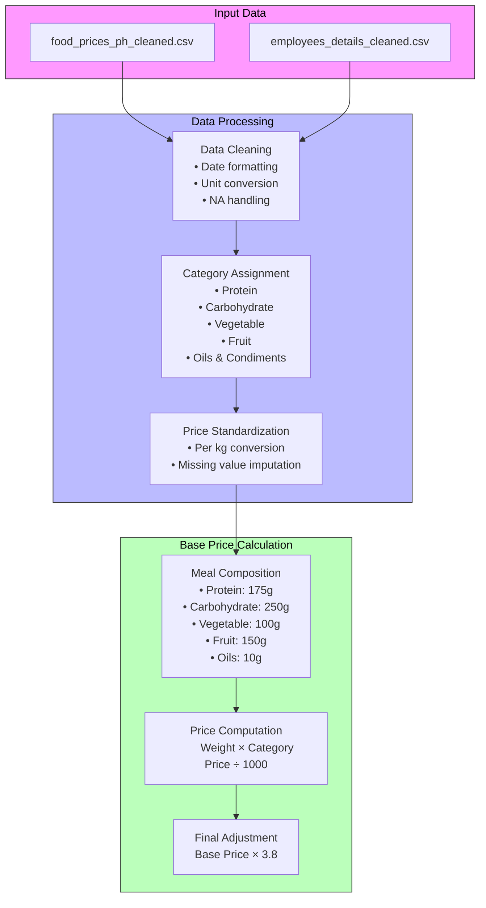
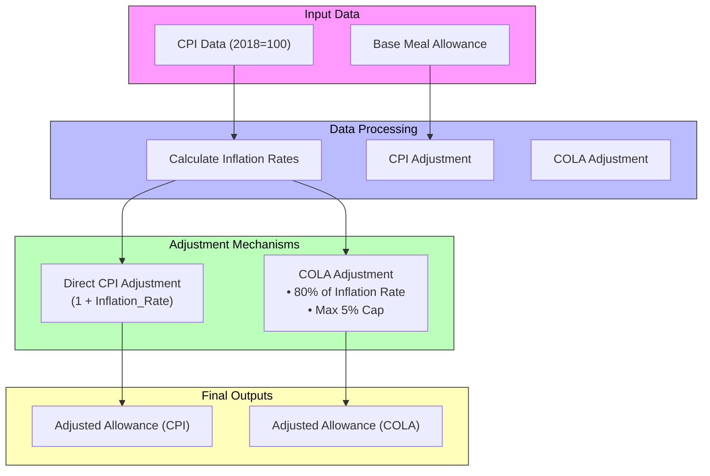
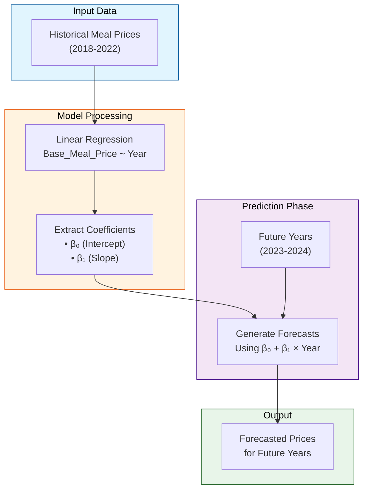

# **Meal Allowance Optimization: Price, Inflation and Prediction**

## **Abstract**

_This project aims to develop data-driven recommendations for optimizing MotorPH's employee meal allowance. Utilizing datasets from the MO-IT100 course and [MotorPH's data repository](https://sites.google.com/mmdc.mcl.edu.ph/motorph/data-repository), the study evaluates three distinct models: (1) a base meal price model derived from historical food price data, (2) an inflation-adjusted allowance using the [Consumer Price Index (CPI)](https://psa.gov.ph/price-indices/cpi-ir?utm_source=chatgpt.com), and (3) a predictive model forecasting future meal costs. Using R and Jupyter Lab for data analysis and visualization, the project highlights the practical application of these tools in statistical modeling and decision support. [Key findings reveal a consistent increase in base meal prices, the impact of inflation on allowance adequacy](https://lattice.com/articles/how-inflation-affects-employee-compensation), and the upward trend of meal costs as forecasted by the predictive model. [The study provides actionable insights to help MotorPH make informed decisions about their employee meal allowance, ensuring it remains relevant and sustainable](https://edenredbenefits.com/is-a-meal-allowance-right-for-your-company/)._

## **Introduction**

[Employee meal allowances are essential elements of compensation packages](https://www.hubengage.com/employee-experience/significance-and-impact-of-employee-allowances/), directly influencing employee satisfaction and well-being. However, [fluctuating food prices and inflation can challenge the maintenance of their real value](https://www.shrm.org/topics-tools/flagships/all-things-work/the-wage-inflation-challenge----balancing-business-sustainabilit). This project [addresses the need for a data-driven approach to optimize MotorPH's employee meal allowance, ensuring its continued adequacy and relevance](https://business.doordash.com/en-us/resources/research-shows-meal-benefits-improve-employee-satisfaction). By leveraging [historical food price data and economic indicators, the study provides actionable insights and recommendations](https://psa.gov.ph/price-indices/cpi-ir?utm_source=chatgpt.com). The project employs R and Jupyter Lab as powerful tools for data analysis, visualization, and statistical modeling, demonstrating their practical utility in solving real-world business challenges.

## **Objectives**

The primary objectives of this project are as follows:

- To develop a base meal price model using historical food price data from MotorPH's data repository.
- To implement an inflation-adjusted meal allowance model using the Consumer Price Index (CPI) and a proxy Cost of Living Adjustment (COLA).
- To create a predictive model to forecast future meal costs, enabling proactive budgeting.
- To provide data-driven recommendations for optimizing MotorPH's employee meal allowance.

## **Scope and Delimitations**

* The analysis is limited to the available datasets and economic indicators provided by the MO-IT100 course and MotorPH's data repository.
* The predictive models are based on simple linear regression; more advanced models could potentially offer greater accuracy.
* The study assumes a specific meal composition for the base meal price model.
* The proxy COLA implementation assumes 80% of CPI with a 5% cap.
* The project does not account for regional variations in food prices or cost of living, unless regional data is specifically incorporated.
* The project focuses on developing a simulation tool for MotorPH, and should not be seen as a perfect representation of real world market conditions.

## **Assumptions and Justifications**  

#### **Base Meal Price Model (Option 1): Scaling Factor Justification**  
- A **scaling factor of 3.8** was applied to simulate restaurant markups and overhead costs, aligning with industry markups (typically **2x to 4x** raw food costs).  
- This factor highlights the potential impact of overhead on meal allowances. A sensitivity analysis could further explore varying markup scenarios.  

#### **Inflation-Adjusted Meal Allowance (Option 2): Proxy COLA Justification**  
- The **proxy Cost of Living Adjustment (COLA)** applies **80% of CPI with a 5% cap**, reflecting a **budget-conscious** approach rather than a full inflation adjustment.  
- This model demonstrates an alternative **realistic corporate policy** balancing employee support and financial constraints.  

#### **Outlier Treatment Justification**  
- **Interquartile Range (IQR) method** was used to remove extreme values, ensuring a **representative dataset** without excessive manipulation.  
- Outliers were **filtered in a single pass** to **preserve data integrity** and avoid distorting legitimate trends.  

#### **Practical vs. Statistical Significance**  
- Some statistical results, while not meeting the **5% significance threshold**, remain **practically relevant** for budgeting and planning.  
- The predictive model offers **trend-based insights**, useful for strategic decision-making despite inherent uncertainty.  

#### **Forward-Looking Perspective**  
- The **predictive model forecasts future meal costs**, enabling **proactive budgeting** for MotorPH.  
- While subject to limitations, it provides a **valuable tool for anticipating cost fluctuations**.  

#### **Simulation Context**  
- This project serves as a **simulation** to guide **meal allowance optimization**.  
- The models provide **a foundation for further analysis and refinement**, helping MotorPH make **data-driven decisions**.  

## **Significance of the Study**

This study is significant for the following reasons:

- It provides MotorPH with data-driven recommendations to optimize their employee meal allowance.
- It demonstrates the application of data analysis and statistical modeling to address real-world business problems.
- It highlights the utility of R and Jupyter Lab as tools for decision support.
- [It contributes to understanding the impact of food prices and inflation on employee compensation](https://www.shrm.org/topics-tools/flagships/all-things-work/the-wage-inflation-challenge----balancing-business-sustainabilit).
- It offers a template that other companies can adapt to evaluate their employee meal allowance.

## **Methods**

This study follows a structured approach to ensure accurate and meaningful results:

### **1. Data Acquisition & Cleaning**
- Obtain food price datasets from the MO-IT100 course and MotorPH's data repository.
- Collect Consumer Price Index (CPI) data from the Philippine Statistics Authority (PSA).
- Clean and preprocess data in R and Jupyter Lab.

### **2. Base Meal Price Model (Option 1)**
The goal is to establish a "base meal price" reflecting the cost of essential ingredients over time.

#### **Data Preprocessing & Computation**
- Load and clean `food_prices_ph_cleaned.csv` and `employees_details_cleaned.csv`.
- Assign food items to categories (protein, carbohydrate, vegetables, fruits, oils & condiments).
- Standardize prices per kilogram, handle missing values, and compute yearly category averages.
- Compute the **base meal price** as:
  
  $$
  \text{Base Meal Price} = \sum \left(\frac{\text{Category Weight}}{1000} \times \text{Category Price}\right)
  $$
  
- Apply a **scaling factor of 3.8** to reflect overhead costs.
- Determine the **daily meal allowance** by rounding the final value to the nearest PHP 10.

### **3. Inflation-Adjusted Meal Allowance (Option 2)**
This model refines the base meal price using CPI and Cost of Living Adjustments (COLA).

#### **Methodology**
- Compute annual inflation rates:
  
  $$
  \text{Inflation Rate} = \frac{\text{CPI}_{\text{current}} - \text{CPI}_{\text{previous}}}{\text{CPI}_{\text{previous}}}
  $$
  
- Adjust the meal allowance using:
  - **CPI Method:** Directly applies the inflation rate.
  - **COLA Method:** Caps annual increases at **5%** and adjusts using **80% of inflation**.
- Compare CPI-adjusted and COLA-adjusted allowances for practical implementation.

### **4. Predictive Meal Price Model (Option 3)**
This approach forecasts future base meal prices using a linear regression model.

#### **Methodology**
- Fit a linear regression model:
  
  $$
  \text{Base Meal Price} = β₀ + β₁ \times \text{Year}
  $$
  
- Use historical meal prices (2018-2022) to predict future costs.
- Evaluate model performance using **R-squared** and statistical tests.
- Generate **forecasted meal prices** for 2023-2024.

### **5. Data Visualization & Interpretation**
- Present results through **interactive plots and dashboards** in R and Jupyter Lab.
- Compare different methodologies and their impact on meal allowance recommendations.
- Provide **actionable insights** for MotorPH’s decision-making.

## **Findings and Interpretation**

### **Summary of Key Figures**
| Year  | Base Meal Price (PHP) | CPI-Adjusted Allowance (PHP) | COLA-Adjusted Allowance (PHP) |
|-------|------------------------|------------------------------|-------------------------------|
| 2019  | 0.00 (Imputed)         | 261.06                       | 258.85                        |
| 2020  | 60.67                  | 257.39                       | 255.91                        |
| 2021  | 64.25                  | 259.33                       | 257.46                        |
| 2022  | 66.71                  | 262.45                       | 259.96                        |

### **1. Base Meal Price Model (Option 1)**
| Year  | Base Meal Price (PHP) |
|-------|------------------------|
| 2019  | 0.00 (Imputed)         |
| 2020  | 60.67                  |
| 2021  | 64.25                  |
| 2022  | 66.71                  |

- The historical food price data from 2019-2022 shows a **consistent upward trend**.
- A **scaling factor of 3.8** was applied to account for restaurant markups, resulting in a **recommended daily meal allowance of 250 PHP**.

### **2. Inflation-Adjusted Meal Allowance (Option 2)**
| Year  | CPI (%) | CPI-Adjusted Allowance (PHP) | COLA-Adjusted Allowance (PHP) |
|-------|--------|------------------------------|-------------------------------|
| 2019  | 4.42   | 261.06                        | 258.85                        |
| 2020  | 2.96   | 257.39                        | 255.91                        |
| 2021  | 3.73   | 259.33                        | 257.46                        |
| 2022  | 4.98   | 262.45                        | 259.96                        |

- CPI data from the **Philippine Statistics Authority (PSA)** was used to adjust the base 250 PHP allowance.
- A **Cost of Living Adjustment (COLA)** was implemented using **80% of CPI with a 5% cap**, providing a **more conservative estimate**.
- The COLA-adjusted figures **moderate inflation’s impact** on employee allowances.

### **3. Predictive Model (Option 3)**
| Metric                     | Value  |
|----------------------------|--------|
| R-squared                 | 0.8607 |
| Adjusted R-squared        | 0.791  |
| Annual Increase Estimate  | 6.487  |
| P-value                   | 0.0723 |

- A **linear regression model** (Base_Meal_Price ~ Year) was used to forecast future prices.
- The model predicts an **average annual increase of 6.49 PHP**.
- The **R-squared value (86.07%)** suggests a strong model fit, but the **p-value (0.0723)** indicates **marginal statistical significance**.
- Due to the **small sample size**, results should be interpreted **with caution**.

### **4. Overall Interpretation and Recommendations**

#### **Key Takeaways:**
- The **upward trend in meal prices** supports the need for **regular allowance adjustments**.  
- CPI and COLA adjustments offer **flexibility** in managing employee meal benefits.  
- The predictive model, while **informative**, has **limitations due to sample size**.  
- The **250 PHP meal allowance** is **within the tax-exempt threshold (800 PHP for de minimis benefits)**, ensuring **regulatory compliance**.  
- The **2019 imputed value (0 PHP)** must be considered when interpreting predictive results.  

### **Final Recommendation**
MotorPH can **adopt a hybrid approach**, using CPI and COLA adjustments for **short-term planning** while incorporating predictive modeling for **future projections and budget planning**.

## **Conclusion**  

This project has developed a **data-driven, adaptable framework** for MotorPH’s staff meal allowances, ensuring that allocations remain **fair, financially prudent, and responsive to economic conditions** in the Philippines.  

- By analyzing **historical food price data**, we established a **realistic base meal price**, reflecting actual commodity costs and nutritional requirements.  
- Integrating **Consumer Price Index (CPI) and Cost of Living Adjustment (COLA)** methodologies enabled **flexible, inflation-responsive adjustments** to meal allowances.  
- A **predictive regression model** provided **forward-looking insights**, allowing MotorPH to **anticipate future cost increases** and proactively budget for employee meal benefits.  
- **Data visualizations** translated complex analyses into **actionable insights**, supporting informed decision-making.  

### **Key Business Impact**  
- Ensures **meal allowances remain fair and competitive** amid rising costs.  
- Provides **flexibility** with **CPI vs. COLA adjustments** to balance employee welfare and budget constraints.  
- Supports **long-term planning** through **predictive modeling**.  
- Enhances **compliance** by staying within tax-exempt benefit limits.  

By combining **statistical rigor with economic insights**, this project equips MotorPH with a **sustainable, scalable solution** for meal allowance management. The framework not only enhances **employee well-being** but also reinforces **financial stability**, ensuring **adaptability in an evolving economic landscape**.  