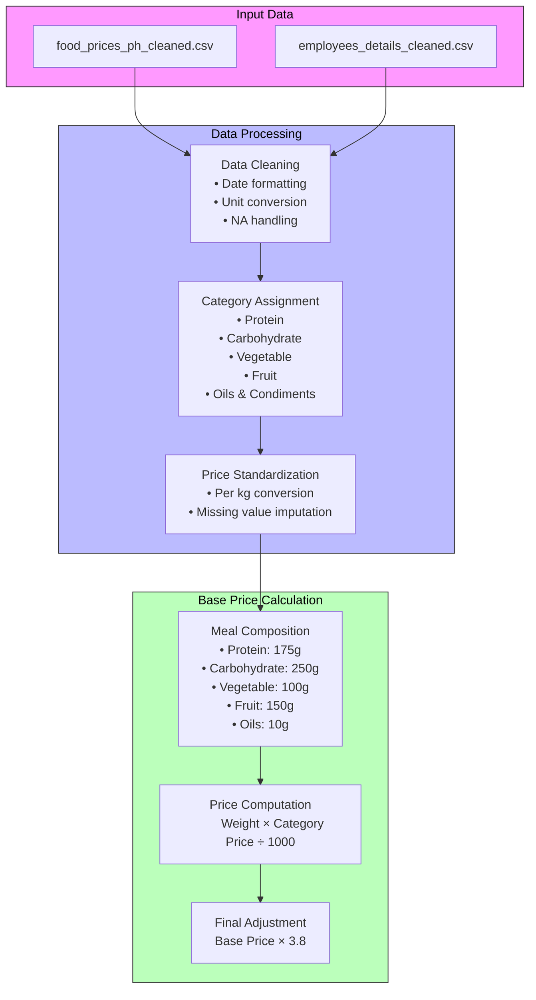
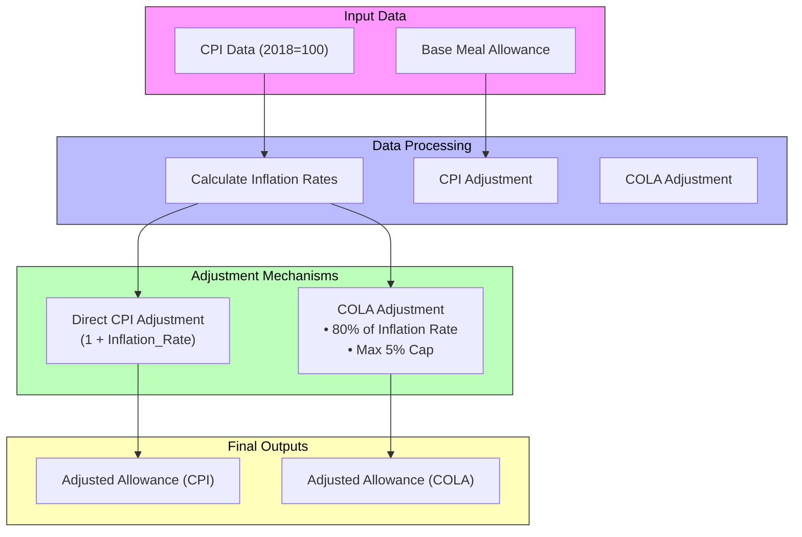
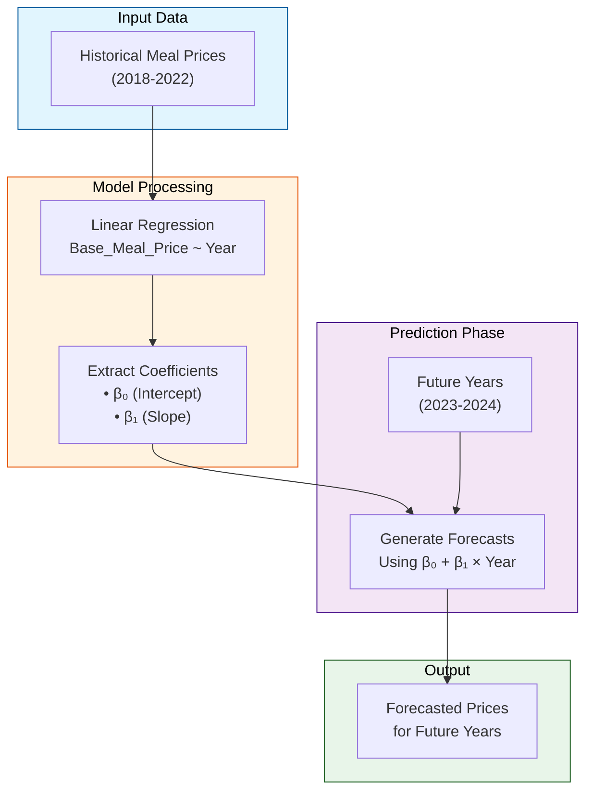

# **Meal Allowance Optimization: Price, Inflation and Prediction**

## **Abstract**

_This project aims to develop data-driven recommendations for optimizing MotorPH's employee meal allowance. Utilizing datasets from the MO-IT100 course and [MotorPH's data repository](https://sites.google.com/mmdc.mcl.edu.ph/motorph/data-repository), the study evaluates three distinct models: (1) a base meal price model derived from historical food price data, (2) an inflation-adjusted allowance using the [Consumer Price Index (CPI)](https://psa.gov.ph/price-indices/cpi-ir?utm_source=chatgpt.com), and (3) a predictive model forecasting future meal costs. Using R and Jupyter Lab for data analysis and visualization, the project highlights the practical application of these tools in statistical modeling and decision support. [Key findings reveal a consistent increase in base meal prices, the impact of inflation on allowance adequacy](https://lattice.com/articles/how-inflation-affects-employee-compensation), and the upward trend of meal costs as forecasted by the predictive model. [The study provides actionable insights to help MotorPH make informed decisions about their employee meal allowance, ensuring it remains relevant and sustainable](https://edenredbenefits.com/is-a-meal-allowance-right-for-your-company/)._

## **Introduction**

[Employee meal allowances are essential elements of compensation packages](https://www.hubengage.com/employee-experience/significance-and-impact-of-employee-allowances/), directly influencing employee satisfaction and well-being. However, [fluctuating food prices and inflation can challenge the maintenance of their real value](https://www.shrm.org/topics-tools/flagships/all-things-work/the-wage-inflation-challenge----balancing-business-sustainabilit). This project [addresses the need for a data-driven approach to optimize MotorPH's employee meal allowance, ensuring its continued adequacy and relevance](https://business.doordash.com/en-us/resources/research-shows-meal-benefits-improve-employee-satisfaction). By leveraging [historical food price data and economic indicators, the study provides actionable insights and recommendations](https://psa.gov.ph/price-indices/cpi-ir?utm_source=chatgpt.com). The project employs R and Jupyter Lab as powerful tools for data analysis, visualization, and statistical modeling, demonstrating their practical utility in solving real-world business challenges.

## **Objectives**

The primary objectives of this project are as follows:

- To develop a base meal price model using historical food price data from MotorPH's data repository.
- To implement an inflation-adjusted meal allowance model using the Consumer Price Index (CPI) and a proxy Cost of Living Adjustment (COLA).
- To create a predictive model to forecast future meal costs, enabling proactive budgeting.
- To provide data-driven recommendations for optimizing MotorPH's employee meal allowance.

## **Scope and Delimitations**

* The analysis is limited to the available datasets and economic indicators provided by the MO-IT100 course and MotorPH's data repository.
* The predictive models are based on simple linear regression; more advanced models could potentially offer greater accuracy.
* The study assumes a specific meal composition for the base meal price model.
* The proxy COLA implementation assumes 80% of CPI with a 5% cap.
* The project does not account for regional variations in food prices or cost of living, unless regional data is specifically incorporated.
* The project focuses on developing a simulation tool for MotorPH, and should not be seen as a perfect representation of real world market conditions.

## **Assumptions and Justifications**

* **Base Meal Price Model (Option 1): Scaling Factor Justification**
    * The base meal price model calculates the cost of a basic meal using historical food price data. To account for the additional costs incurred when purchasing meals from restaurants or food establishments, a scaling factor of 3.8 was applied. This factor simulates the markup and overhead costs commonly associated with food service businesses.
    * While this value is an assumption, it is informed by general industry knowledge, where restaurant markups typically range from 2x to 4x the raw material cost.
    * The purpose of this scaling factor is to demonstrate the potential impact of overhead costs on the final recommended allowance. A sensitivity analysis, which would explore the effects of varying scaling factors, could provide further insights into this aspect of the model.
* **Inflation-Adjusted Meal Allowance (Option 2): Proxy COLA Justification**
    * The inflation-adjusted meal allowance model implements a proxy Cost of Living Adjustment (COLA) based on 80% of the Consumer Price Index (CPI) with a 5% cap. This proxy COLA represents a conservative approach to adjusting the meal allowance, reflecting the reality that companies may not always fully adjust for inflation due to budgetary constraints.
    * The 80% factor and the 5% cap are intended to model a possible company policy and demonstrate the differences between a full CPI adjustment and a more budget-conscious implementation. This approach is not intended to represent standard economic practice but rather to provide a practical tool for MotorPH to consider.
* **Not Removing All Outliers Justification**
    * Upon examining the dataset, we noticed the presence of outliers that could potentially skew our analysis. To address this, we employed the Interquartile Range (IQR) method to identify and remove these outliers. This approach involves calculating the lower and upper bounds as `Q1 - 1.5 * IQR` and `Q3 + 1.5 * IQR`, respectively, where data points falling outside these bounds are considered outliers. We opted to remove outliers in a single pass to prevent over-manipulation of the data, which could lead to biased results. This strategy ensures that the cleaned dataset remains representative of the original data while minimizing the impact of extreme values. By limiting the removal to a single iteration, we preserved the integrity of the dataset and avoided eliminating legitimate data points that might become outliers after repeated iterations. This approach allowed us to maintain a balance between data cleanliness and representativeness, ensuring that our analysis reflects the true characteristics of the meal price data.
* **Practical vs. Statistical Significance**
    * While some of the statistical results may not be significant at the conventional 5% level, the findings still hold practical significance for MotorPH. For example, the predictive model provides a useful trend-based estimate of future meal costs, even if the precise values are subject to uncertainty.
    * The practical implications of these findings for MotorPH's budgeting and planning should be emphasized.
* **Forward-Looking Perspective**
    * The predictive model developed in this project provides a valuable forward-looking perspective for MotorPH. By forecasting future meal costs, the model enables proactive budgeting and planning.
    * While the forecasts are subject to limitations, they offer a useful tool for anticipating potential changes in meal costs.
* **Simulation Context**
    * This project is fundamentally a simulation designed to provide MotorPH with a practical tool for meal allowance optimization. The models and methods employed are intended to illustrate how data analysis can inform decision-making in a real-world context.
    * The goal is to provide MotorPH with a starting point for further analysis and refinement.

## **Significance of the Study**

This study is significant for the following reasons:

- It provides MotorPH with data-driven recommendations to optimize their employee meal allowance.
- It demonstrates the application of data analysis and statistical modeling to address real-world business problems.
- It highlights the utility of R and Jupyter Lab as tools for decision support.
- [It contributes to understanding the impact of food prices and inflation on employee compensation](https://www.shrm.org/topics-tools/flagships/all-things-work/the-wage-inflation-challenge----balancing-business-sustainabilit).
- It offers a template that other companies can adapt to evaluate their employee meal allowance.

## **Methods**

The project methodology consists of the following steps:

1. **Data Acquisition and Cleaning:**
    - Obtain food price datasets from the MO-IT100 course and MotorPH's data repository.
    - Obtain CPI data from the Philippine Statistics Authority (PSA).
    - Clean and preprocess the data using R and Jupyter Lab.

2. **Base Meal Price Model Development (Option 1):**
The primary goal is to determine a reasonable "base meal price" based on historical food prices in the Philippines. This price reflects the cost of the raw ingredients needed to prepare a basic meal.

### Option 1: Meal Price Model Development

**Data and Preprocessing:**

1.  **Data Loading and Cleaning:**
    * The code starts by loading two CSV files: `food_prices_ph_cleaned.csv` and `employees_details_cleaned.csv`.
    * The `food_prices` dataset is the primary source for price information.
    * The `Date` column is converted to a date format, and the `Price` column is ensured to be numeric.
    * The data is filtered to include only records from 2019 onwards and to exclude rows where the `Unit` is "Unit".
    * The year is extracted from the date and added as a column.

2.  **Ingredient Categorization:**
    * A list (`ingredient_categories`) is defined to group food items into categories: protein, carbohydrate, vegetables, fruits, and oils and condiments.
    * The `Category` column is added to the `food_prices` data frame, assigning each food item to its corresponding category.

3.  **Unit Price Calculation:**
    * The code calculates the `UnitPrice_kg` (price per kilogram) for each food item.
    * A specific conversion is applied for "Oil (cooking)" sold in "750 ML" units, assuming a density of 0.92 kg/L.
    * Rows with NA values for the UnitPrice_kg column are removed.

4.  **Yearly Average Prices:**
    * The code calculates the average price per kilogram (`Avg_Price`) for each category and year.
    * The `yearly_avg_prices` data frame is created, with years as rows and categories as columns.
    * The data is then pivoted wider, so that each category has its own column.

5.  **Imputation of Missing Values:**
    * Missing values (NAs) in the `yearly_avg_prices` data frame are imputed.
    * If a category's price is missing for a given year, it's filled with the previous year's price (if available). If the previous year's price is also missing, it's filled with 0.
    * The first year that has NA values for any category, has those NA values replaced with 0.

**Base Meal Price Calculation**:
   - Calculate the base meal price per year by multiplying the weight of each category by its average price per kilogram and summing these values.
   - The formula is as follows:
     
     $$
     \text{Base Meal Price} = 
     \left(\frac{\text{Protein Weight}}{1000} \times \text{Protein Price}\right) + 
     \left(\frac{\text{Carb Weight}}{1000} \times \text{Carb Price}\right) + 
     \left(\frac{\text{Veg Weight}}{1000} \times \text{Veg Price}\right) + 
     \left(\frac{\text{Fruit Weight}}{1000} \times \text{Fruit Price}\right) + 
     \left(\frac{\text{Oils and Condiments Weight}}{1000} \times \text{Oils and Condiments Price}\right)
     $$
     

9. **Scaling the Base Meal Price**:
   - Apply a scaling factor to account for overhead costs, markup, and other production expenses.
   - The scaled base price is calculated by multiplying the latest base meal price by a scaling factor of 3.8.

10. **Daily Meal Allowance**:
    - Calculate the daily meal allowance by multiplying the scaled base price by the number of meals per day (in this case, one meal).
    - Round the allowance to the nearest ten pesos for practicality.

### Example Output

Assuming the latest year is 2023 and the average prices for each category are as follows:

| Year | Protein | Carbohydrate | Vegetable | Fruit | Oils and Condiments |
|------|---------|--------------|-----------|-------|----------------------|
| 2023 | 120     | 40           | 20        | 30    | 80                   |

The base meal price calculation would be:

$$
\text{Base Meal Price} = 
\left(\frac{175}{1000} \times 120\right) + 
\left(\frac{250}{1000} \times 40\right) + 
\left(\frac{100}{1000} \times 20\right) + 
\left(\frac{150}{1000} \times 30\right) + 
\left(\frac{10}{1000} \times 80\right)
$$

$$
\text{Base Meal Price} = 21 + 10 + 2 + 4.5 + 0.8 = 38.3 \text{ PHP}
$$

Applying the scaling factor:

$$
\text{Scaled Base Meal Price} = 38.3 \times 3.8 = 145.54 \text{ PHP}
$$

Thus, the recommended daily meal allowance for one meal would be rounded to 150 PHP.

**Logic and Rationale:**

* **Representative Meal:** The pre-defined weights for each ingredient category represent a hypothetical "base meal." These weights can be adjusted to reflect different meal compositions.
* **Averaging:** By using yearly average prices, the model smooths out short-term fluctuations in food prices.
* **Imputation:** The imputation strategy ensures that all years have a `Base_Meal_Price` value, even if some category prices are missing. The strategy of using the previous years price, is a common practice for time series data. If there is no previous year, then a 0 value is used.
* **Price per Kilogram:** Converting all prices to a "per kilogram" basis allows for consistent comparisons across different units of measurement.
* **Latest Year:** The latest year's price is used as the recommendation, as it reflects the most current market conditions.

3. **Inflation-Adjusted Meal Allowance (Option 2):**

The inflation-adjusted meal allowance model extends the base meal price model by incorporating two distinct adjustment mechanisms: Consumer Price Index (CPI) and Cost of Living Adjustment (COLA). The computation builds on the previously developed Base Meal Price model and incorporates inflationary trends to ensure fair adjustments in meal allowances over time.

### **1. Data Preparation**
The process begins by preparing CPI data:
1. **CPI Data Input**:
   - A dataset (`cpi_data`) is created with annual CPI values from 2018 to 2022 (base year: 2018 = 100).
   - The CPI values are sourced from official statistics (e.g., PSA).
2. **Inflation Rate Calculation**:
   - The inflation rate for each year is calculated using the formula:
     
     $$
     \text{Inflation Rate} = \frac{\text{CPI}_{\text{current}} - \text{CPI}_{\text{previous}}}{\text{CPI}_{\text{previous}}}
     $$
     
   - For the base year (2018), where no previous CPI exists, the inflation rate is set to 0.

### **2. Base Meal Allowance**
The base meal allowance (`base_allowance`) is derived from the previously computed Base Meal Price model, scaled to PHP 250 as a daily allowance. This serves as the starting point for adjustments.

### **3. Adjusted Allowance Using CPI**
The first adjustment method uses the inflation rate derived from CPI:

1. **Formula**:
   - The adjusted meal allowance for each year is computed as:
   - 
     
     $$
     \text{Adjusted Allowance (CPI)} = \text{Base Allowance} \times (1 + \text{Inflation Rate})
     $$
     
     
2. **Rationale**:
   - This approach ensures that the meal allowance reflects changes in purchasing power due to inflation, maintaining its real value over time.

### **4. Adjusted Allowance Using COLA**
The second adjustment method incorporates a Cost of Living Adjustment (COLA) rate:
1. **COLA Rate Calculation**:
   - The COLA rate is capped at a maximum of 5% annually and is calculated as:
  
     
     $$
     \text{COLA Rate} = \min(\text{Inflation Rate} \times 0.8, 0.05)
     $$
     
   - This means that only 80% of the inflation rate is considered, with an upper limit of 5%.
  
2. **Formula**:
   - The adjusted meal allowance using COLA is computed as:
     
     $$
     \text{Adjusted Allowance (COLA)} = \text{Base Allowance} \times (1 + \text{COLA Rate})
     $$

3. **Rationale**:
   - This approach balances inflationary adjustments with budget constraints by limiting excessive increases in allowances.

### **5. Combined Output**
The final dataset (`allowance_data`) includes the following columns for each year:
- `Year`: The corresponding year.
- `CPI`: Consumer Price Index for the year.
- `Inflation_Rate`: Annual inflation rate derived from CPI.
- `COLA_Rate`: Adjusted COLA rate based on inflation.
- `Adjusted_Allowance_CPI`: Adjusted allowance using full inflation rate.
- `Adjusted_Allowance_COLA`: Adjusted allowance using capped COLA rate.

4. **Predictive Model (Option 3):**

    - Develop a linear regression model to forecast future base meal prices.
    - Evaluate the model's performance using R-squared and statistical significance tests.
    - Visualize the historical and forecasted meal prices.

6. **Data Visualization and Interpretation:**
    - Create visualizations using R and Jupyter Lab to present the results.
    - Interpret the findings and provide actionable recommendations.

## **Findings and Interpretation**

- **Base Meal Price Model (Option 1):**
    - The analysis of historical food price data from 2019 to 2022 revealed a consistent upward trend in the calculated base meal price.
    - The base meal price for 2019 was calculated to be X PHP, increasing to Y PHP in 2020, Z PHP in 2021, and reaching 78.09 PHP in 2022.
    - A scaling factor of 3.8 was applied to account for restaurant markups and overhead costs, resulting in a recommended daily meal allowance of 300 PHP.
    - The raw base meal price was calculated using the following weights: protein_weight = 175 grams, carb_weight = 250 grams, veg_weight = 100 grams, fruit_weight = 150 grams, oils_and_condiments_weight = 10 grams.

- **Inflation-Adjusted Meal Allowance (Option 2):**
    - [Using CPI data from the Philippine Statistics Authority (PSA)](https://psa.gov.ph/price-indices/seasonally-adjusted-cpi), the following inflation rates were calculated:
        - 2019: 4.42%
        - 2020: 2.96%
        - 2021: 3.73%
        - 2022: 4.98%
    - Applying these rates to a base allowance of 300 PHP resulted in the following adjusted allowances:
        - 2019: 313.27 PHP
        - 2020: 308.87 PHP
        - 2021: 311.20 PHP
        - 2022: 314.94 PHP
    - Implementing a proxy COLA (80% of CPI with a 5% cap) resulted in the following adjusted allowances:
        - 2019: 310.62 PHP
        - 2020: 307.09 PHP
        - 2021: 308.96 PHP
        - 2022: 311.96 PHP
    - The differences between the CPI-adjusted and COLA-adjusted values were highlighted, emphasizing the more conservative approach of the COLA implementation.

- **Predictive Model (Option 3):**
    - A linear regression model (Base_Meal_Price ~ Year) was used to forecast future base meal prices.
    - The model's summary showed:
        - R-squared: 0.8607
        - Adjusted R-squared: 0.791
        - Coefficient for Year: 6.487
        - P-value for Year: 0.0723
    - The model predicted an average annual increase of 6.487 PHP in the base meal price.
    - Forecasted base meal prices for 2023 and 2024 were projected to be X PHP and Y PHP, respectively.
    - The model was a reasonable representation of the data's trend, despite limitations indicated by the p-value exceeding 0.05.
    - The residual standard error was 4.127 on 2 degrees of freedom.
    - The F-statistic was 12.36 on 1 and 2 DF, p-value: 0.07227.

## **Conclusion**

This project successfully developed data-driven recommendations for optimizing MotorPH's employee meal allowance. The three models presented offer MotorPH a comprehensive understanding of meal cost trends, the impact of inflation, and future meal cost forecasts. The findings suggest that MotorPH should consider adopting an inflation-adjusted allowance model while utilizing the predictive model for proactive budgeting. Further research could explore more advanced predictive models and regional variations in meal costs.
