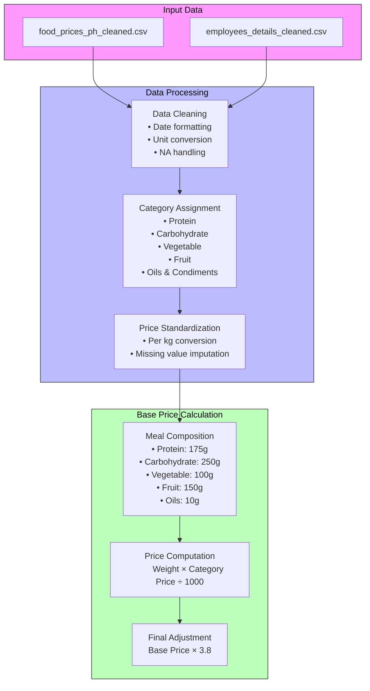
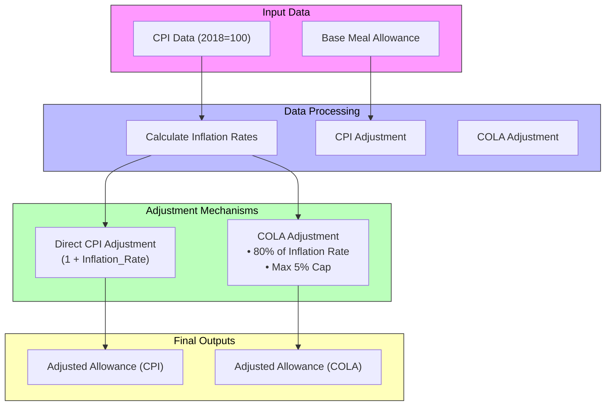
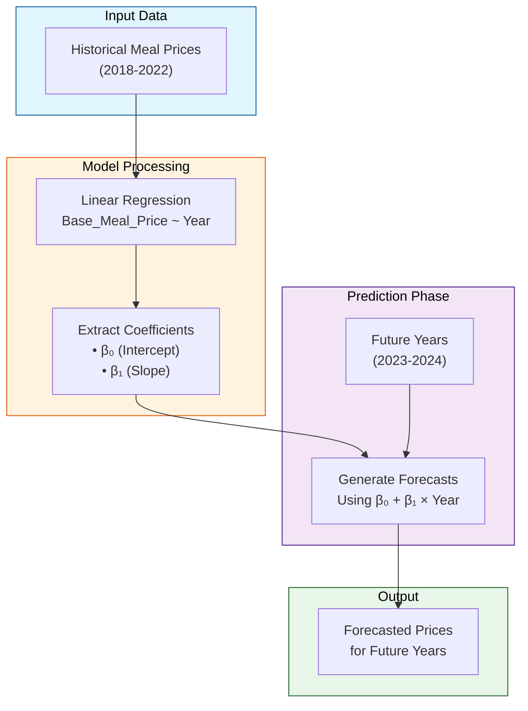
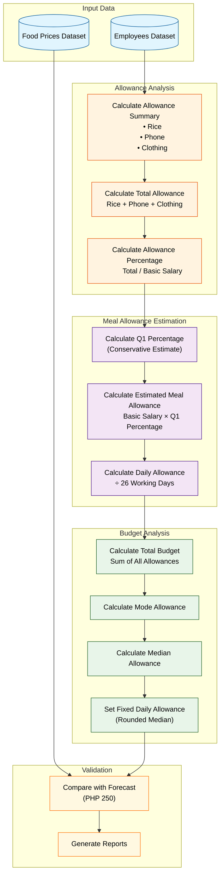

# **Meal Allowance Optimization: Price, Inflation and Prediction - Summary & Documentation**

## **Abstract**

_This project aims to develop data-driven recommendations for optimizing MotorPH's employee meal allowance. Utilizing datasets from the MO-IT100 course and [MotorPH's data repository](https://sites.google.com/mmdc.mcl.edu.ph/motorph/data-repository), the study evaluates three distinct models: (1) a base meal price model derived from historical food price data, (2) an inflation-adjusted allowance using the [Consumer Price Index (CPI)](https://psa.gov.ph/price-indices/cpi-ir?utm_source=chatgpt.com), and (3) a predictive model forecasting future meal costs. Using R and Jupyter Lab for data analysis and visualization, the project highlights the practical application of these tools in statistical modeling and decision support. [Key findings reveal a consistent increase in base meal prices, the impact of inflation on allowance adequacy](https://lattice.com/articles/how-inflation-affects-employee-compensation), and the upward trend of meal costs as forecasted by the predictive model. [The study provides actionable insights to help MotorPH make informed decisions about their employee meal allowance, ensuring it remains relevant and sustainable](https://edenredbenefits.com/is-a-meal-allowance-right-for-your-company/)._

## **Introduction**

[Employee meal allowances are essential elements of compensation packages](https://www.hubengage.com/employee-experience/significance-and-impact-of-employee-allowances/), directly influencing employee satisfaction and well-being. However, [fluctuating food prices and inflation can challenge the maintenance of their real value](https://www.shrm.org/topics-tools/flagships/all-things-work/the-wage-inflation-challenge----balancing-business-sustainabilit). This project [addresses the need for a data-driven approach to optimize MotorPH's employee meal allowance, ensuring its continued adequacy and relevance](https://business.doordash.com/en-us/resources/research-shows-meal-benefits-improve-employee-satisfaction). By leveraging [historical food price data and economic indicators, the study provides actionable insights and recommendations](https://psa.gov.ph/price-indices/cpi-ir?utm_source=chatgpt.com). The project employs R and Jupyter Lab as powerful tools for data analysis, visualization, and statistical modeling, demonstrating their practical utility in solving real-world business challenges.

## **Objectives**

The primary objectives of this project are as follows:

- To develop a base meal price model using historical food price data from MotorPH's data repository.
- To implement an inflation-adjusted meal allowance model using the Consumer Price Index (CPI) and a proxy Cost of Living Adjustment (COLA).
- To create a predictive model to forecast future meal costs, enabling proactive budgeting.
- To provide supplementary contextual analysis of MotorPH's potential meal allowance budget based on existing allowance practices.
- To provide data-driven recommendations for optimizing MotorPH's employee meal allowance.

## **Scope and Delimitations**

* The analysis is limited to the available datasets and economic indicators provided by the MO-IT100 course and MotorPH's data repository.
* The predictive models are based on simple linear regression; more advanced models could potentially offer greater accuracy.
* The study assumes a specific meal composition for the base meal price model.
* The proxy COLA implementation assumes 80% of CPI with a 5% cap.
* The project does not account for regional variations in food prices or cost of living, unless regional data is specifically incorporated.
* The project focuses on developing a simulation tool for MotorPH, and should not be seen as a perfect representation of real world market conditions.

## **Assumptions and Justifications**  

#### **Base Meal Price Model (Option 1): Scaling Factor Justification**  
- A **scaling factor of 3.8** was applied to simulate restaurant markups and overhead costs, aligning with industry markups (typically **2x to 4x** raw food costs).  
- This factor highlights the potential impact of overhead on meal allowances. A sensitivity analysis could further explore varying markup scenarios.  

#### **Inflation-Adjusted Meal Allowance (Option 2): Proxy COLA Justification**  
- The **proxy Cost of Living Adjustment (COLA)** applies **80% of CPI with a 5% cap**, reflecting a **budget-conscious** approach rather than a full inflation adjustment.  
- This model demonstrates an alternative **realistic corporate policy** balancing employee support and financial constraints.  

#### **Outlier Treatment Justification**  
- **Interquartile Range (IQR) method** was used to remove extreme values, ensuring a **representative dataset** without excessive manipulation.  
- Outliers were **filtered in a single pass** to **preserve data integrity** and avoid distorting legitimate trends.  

#### **Practical vs. Statistical Significance**  
- Some statistical results, while not meeting the **5% significance threshold**, remain **practically relevant** for budgeting and planning.  
- The predictive model offers **trend-based insights**, useful for strategic decision-making despite inherent uncertainty.  

#### **Forward-Looking Perspective**  
- The **predictive model forecasts future meal costs**, enabling **proactive budgeting** for MotorPH.  
- While subject to limitations, it provides a **valuable tool for anticipating cost fluctuations**.  

#### **Simulation Context**  
- This project serves as a **simulation** to guide **meal allowance optimization**.  
- The models provide **a foundation for further analysis and refinement**, helping MotorPH make **data-driven decisions**.  

## **Significance of the Study**

This study is significant for the following reasons:

- It provides MotorPH with data-driven recommendations to optimize their employee meal allowance.
- It demonstrates the application of data analysis and statistical modeling to address real-world business problems.
- It highlights the utility of R and Jupyter Lab as tools for decision support.
- [It contributes to understanding the impact of food prices and inflation on employee compensation](https://www.shrm.org/topics-tools/flagships/all-things-work/the-wage-inflation-challenge----balancing-business-sustainabilit).
- It offers a template that other companies can adapt to evaluate their employee meal allowance.

## **Methods**

This study follows a structured approach to ensure accurate and meaningful results:

### **1. Data Acquisition & Cleaning**
- Obtain food price datasets from the MO-IT100 course and MotorPH's data repository.
- Collect Consumer Price Index (CPI) data from the Philippine Statistics Authority (PSA).
- Clean and preprocess data in R and Jupyter Lab.

### **2. Base Meal Price Model (Option 1)**
The goal is to establish a "base meal price" reflecting the cost of essential ingredients over time.

```mermaid
flowchart TD
    subgraph Input["Input Data"]
        CSV1["food_prices_ph_cleaned.csv"]
        CSV2["employees_details_cleaned.csv"]
    end
    
    subgraph Processing["Data Processing"]
        Clean["Data Cleaning
        • Date formatting
        • Unit conversion
        • NA handling"]
        
        Cat["Category Assignment
        • Protein
        • Carbohydrate
        • Vegetable
        • Fruit
        • Oils & Condiments"]
        
        Price["Price Standardization
        • Per kg conversion
        • Missing value imputation"]
    end
    
    subgraph Calculation["Base Price Calculation"]
        Comp["Meal Composition
        • Protein: 175g
        • Carbohydrate: 250g
        • Vegetable: 100g
        • Fruit: 150g
        • Oils: 10g"]
        
        Calc["Price Computation
        Weight × Category Price ÷ 1000"]
        
        Scale["Final Adjustment
        Base Price × 3.8"]
    end
    
    CSV1 --> Clean
    CSV2 --> Clean
    Clean --> Cat
    Cat --> Price
    Price --> Comp
    Comp --> Calc
    Calc --> Scale
    
    style Input fill:#f9f,stroke:#333,color:#000
    style Processing fill:#bbf,stroke:#333,color:#000
    style Calculation fill:#bfb,stroke:#333,color:#000
```

#### **Data Preprocessing & Computation**
- Load and clean `food_prices_ph_cleaned.csv` and `employees_details_cleaned.csv`.
- Assign food items to categories (protein, carbohydrate, vegetables, fruits, oils & condiments).
- Standardize prices per kilogram, handle missing values, and compute yearly category averages.
- Compute the **base meal price** as:
  
  $$
  \text{Base Meal Price} = \sum \left(\frac{\text{Category Weight}}{1000} \times \text{Category Price}\right)
  $$
  
- Apply a **scaling factor of 3.8** to reflect overhead costs.
- Determine the **daily meal allowance** by rounding the final value to the nearest PHP 10.

### **3. Inflation-Adjusted Meal Allowance (Option 2)**
This model refines the base meal price using CPI and Cost of Living Adjustments (COLA).

```mermaid
flowchart TD
    subgraph Input["Input Data"]
        direction TB
        Base["Base Meal Allowance"]
        CPI["CPI Data (2018=100)"]
    end
    
    subgraph Processing["Data Processing"]
        direction TB
        Rates["Calculate Inflation Rates"]
        CPI_Adjust["CPI Adjustment"]
        COLA_Adjust["COLA Adjustment"]
    end
    
    subgraph Adjustments["Adjustment Mechanisms"]
        direction TB
        CPI_Calc["Direct CPI Adjustment
        (1 + Inflation_Rate)"]
        COLA_Calc["COLA Adjustment
        • 80% of Inflation Rate
        • Max 5% Cap"]
    end
    
    subgraph Output["Final Outputs"]
        direction TB
        CPI_Out["Adjusted Allowance (CPI)"]
        COLA_Out["Adjusted Allowance (COLA)"]
    end
    
    Base --> CPI_Adjust
    CPI --> Rates
    Rates --> CPI_Calc
    Rates --> COLA_Calc
    CPI_Calc --> CPI_Out
    COLA_Calc --> COLA_Out
    
    style Input fill:#f9f,stroke:#333,color:#000
    style Processing fill:#bbf,stroke:#333,color:#000
    style Adjustments fill:#bfb,stroke:#333,color:#000
    style Output fill:#ffb,stroke:#333,color:#000
```

#### **Methodology**
- Compute annual inflation rates:

$$ \text{Inflation Rate} = \frac{\text{CPI Current} - \text{CPI Previous}}{\text{CPI Previous}} $$

- Adjust the meal allowance using:
  - **CPI Method:** Directly applies the inflation rate.
  - **COLA Method:** Caps annual increases at **5%** and adjusts using **80% of inflation**.
- Compare CPI-adjusted and COLA-adjusted allowances for practical implementation.

### **4. Predictive Meal Price Model (Option 3)**
This approach forecasts future base meal prices using a linear regression model.

```mermaid
flowchart TD
    subgraph Input["Input Data"]
        Historical["Historical Meal Prices
        (2018-2022)"]
    end
    
    subgraph Processing["Model Processing"]
        Model["Linear Regression
        Base_Meal_Price ~ Year"]
        Coeff["Extract Coefficients
        • β₀ (Intercept)
        • β₁ (Slope)"]
    end
    
    subgraph Prediction["Prediction Phase"]
        Future["Future Years
        (2023-2024)"]
        Forecast["Generate Forecasts
        Using β₀ + β₁ × Year"]
    end
    
    subgraph Output["Output"]
        Results["Forecasted Prices
        for Future Years"]
    end
    
    Historical --> Model
    Model --> Coeff
    Coeff --> Forecast
    Future --> Forecast
    Forecast --> Results
    
    style Input fill:#e1f5fe,stroke:#01579b,color:#000000
    style Processing fill:#fff3e0,stroke:#e65100,color:#000000
    style Prediction fill:#f3e5f5,stroke:#4a148c,color:#000000
    style Output fill:#e8f5e9,stroke:#1b5e20,color:#000000
```

#### **Methodology**
- Fit a linear regression model:

$$ \text{Base Meal Price} = \beta_0 + \beta_1 \times \text{Year} $$

- Use historical meal prices (2018-2022) to predict future costs.
- Evaluate model performance using **R-squared** and statistical tests.
- Generate **forecasted meal prices** for 2023-2024.

## **Findings and Interpretation**

### **Summary of Key Figures**
| Year  | Base Meal Price (PHP) | CPI-Adjusted Allowance (PHP) | COLA-Adjusted Allowance (PHP) |
|-------|------------------------|------------------------------|-------------------------------|
| 2019  | 0.00 (Imputed)         | 261.06                       | 258.85                        |
| 2020  | 60.67                  | 257.39                       | 255.91                        |
| 2021  | 64.25                  | 259.33                       | 257.46                        |
| 2022  | 66.71                  | 262.45                       | 259.96                        |

### **1. Base Meal Price Model (Option 1)**
| Year  | Base Meal Price (PHP) |
|-------|------------------------|
| 2019  | 0.00 (Imputed)         |
| 2020  | 60.67                  |
| 2021  | 64.25                  |
| 2022  | 66.71                  |

- The historical food price data from 2019-2022 shows a **consistent upward trend**.
- A **scaling factor of 3.8** was applied to account for restaurant markups, resulting in a **recommended daily meal allowance of 250 PHP**.

### **2. Inflation-Adjusted Meal Allowance (Option 2)**
| Year  | CPI (%) | CPI-Adjusted Allowance (PHP) | COLA-Adjusted Allowance (PHP) |
|-------|--------|------------------------------|-------------------------------|
| 2019  | 4.42   | 261.06                        | 258.85                        |
| 2020  | 2.96   | 257.39                        | 255.91                        |
| 2021  | 3.73   | 259.33                        | 257.46                        |
| 2022  | 4.98   | 262.45                        | 259.96                        |

- CPI data from the **Philippine Statistics Authority (PSA)** was used to adjust the base 250 PHP allowance.
- A **Cost of Living Adjustment (COLA)** was implemented using **80% of CPI with a 5% cap**, providing a **more conservative estimate**.
- The COLA-adjusted figures **moderate inflation’s impact** on employee allowances.

### **3. Predictive Model (Option 3)**
| Metric                     | Value  |
|----------------------------|--------|
| R-squared                 | 0.8607 |
| Adjusted R-squared        | 0.791  |
| Annual Increase Estimate  | 6.487  |
| P-value                   | 0.0723 |

- A **linear regression model** (Base_Meal_Price ~ Year) was used to forecast future prices.
- The model predicts an **average annual increase of 6.49 PHP**.
- The **R-squared value (86.07%)** suggests a strong model fit, but the **p-value (0.0723)** indicates **marginal statistical significance**.
- Due to the **small sample size**, results should be interpreted **with caution**.

### **Interpretation**

- The **upward trend in meal prices** supports the need for **regular allowance adjustments**.  
- CPI and COLA adjustments offer **flexibility** in managing employee meal benefits.  
- The predictive model, while **informative**, has **limitations due to sample size**.  
- The **250 PHP** meal allowance is within the **tax-exempt threshold of 800 PHP for de minimis benefits**, ensuring regulatory compliance.
    - According to Kalibrr (2023)](https://neo-blog.kalibrr.com/blog/de-minimis-per-diem-service-charges-etc-little-known-employee-benefits-in-the-philippines) and [Grant Thornton (2023)](https://www.grantthornton.com.ph/insights/articles-and-updates1/lets-talk-tax/better-perks-for-happier-employees-non-taxability-of-employee-de-minimis-benefits/), meal allowances are classified as de minimis benefits in the Philippines and are non-taxable up to the prescribed threshold. While [Kalibrr (2023)](https://neo-blog.kalibrr.com/blog/de-minimis-per-diem-service-charges-etc-little-known-employee-benefits-in-the-philippines) discusses this primarily for the government sector, the principles apply to private companies as well. [Grant Thornton (2023)](https://www.grantthornton.com.ph/insights/articles-and-updates1/lets-talk-tax/better-perks-for-happier-employees-non-taxability-of-employee-de-minimis-benefits/) confirms that meal allowances up to **PHP 800 per day are tax-exempt**, and our recommended **PHP 250** daily allowance complies with these regulations, ensuring fairness for employees.
- The **2019 imputed value (0 PHP)** must be considered when interpreting predictive results.  

### **Supplementary Context: Budgetary Analysis**

This analysis provides a supplementary contextual view of MotorPH's potential meal allowance budget, based on their existing allowance practices (rice, phone, clothing).

It uses these existing allowances as a proxy to determine a perceived initial meal allowance, reflecting MotorPH's current spending patterns and comfort level with employee benefits. Using statistical analysis, we estimate an appropriate meal allowance while considering employees' existing benefits and salary structures.

```mermaid
flowchart TD
    subgraph Input["Input Data"]
        E[("Employees Dataset")]
        F[("Food Prices Dataset")]
    end

    subgraph Analysis["Allowance Analysis"]
        A1["Calculate Allowance Summary
        • Rice
        • Phone
        • Clothing"]
        A2["Calculate Total Allowance
        Rice + Phone + Clothing"]
        A3["Calculate Allowance Percentage
        Total / Basic Salary"]
    end

    subgraph Estimation["Meal Allowance Estimation"]
        E1["Calculate Q1 Percentage
        (Conservative Estimate)"]
        E2["Calculate Estimated Meal Allowance
        Basic Salary × Q1 Percentage"]
        E3["Calculate Daily Allowance
        ÷ 26 Working Days"]
    end

    subgraph Budget["Budget Analysis"]
        B1["Calculate Total Budget
        Sum of All Allowances"]
        B2["Calculate Mode Allowance"]
        B3["Calculate Median Allowance"]
        B4["Set Fixed Daily Allowance
        (Rounded Median)"]
    end

    subgraph Validation["Validation"]
        V1["Compare with Forecast
        (PHP 250)"]
        V2["Generate Reports"]
    end

    E --> A1
    F --> V1
    A1 --> A2
    A2 --> A3
    A3 --> E1
    E1 --> E2
    E2 --> E3
    E3 --> B1
    B1 --> B2
    B2 --> B3
    B3 --> B4
    B4 --> V1
    V1 --> V2

    classDef input fill:#e1f5fe,stroke:#01579b,color:#000000
    classDef analysis fill:#fff3e0,stroke:#e65100,color:#000000
    classDef estimation fill:#f3e5f5,stroke:#4a148c,color:#000000
    classDef budget fill:#e8f5e9,stroke:#1b5e20,color:#000000
    classDef validation fill:#fff8e1,stroke:#ff6f00,color:#000000
    
    class E,F input
    class A1,A2,A3 analysis
    class E1,E2,E3 estimation
    class B1,B2,B3,B4 budget
    class V1,V2 validation
```

## Methodology
The approach consists of the following key steps:

### 1. Analyze Existing Allowances
- The dataset includes employee allowance details such as:
  - **Rice Subsidy**
  - **Phone Allowance**
  - **Clothing Allowance**
- The mean and median values for each allowance type are calculated to understand the central tendency of current benefits.

### 2. Establish a Relative Percentage/Range

A new metric, Total Existing Allowance, is calculated as:

$$ \text{Total Existing Allowance} = \text{Rice Subsidy} + \text{Phone Allowance} + \text{Clothing Allowance} $$

The Allowance Percentage relative to Basic Salary is computed as:

$$ \text{Allowance Percentage} = \frac{\text{Total Existing Allowance}}{\text{Basic Salary}} $$

Statistical summaries (mean, median, Q1, Q3) for the Allowance Percentage are generated to understand its distribution.

### 3. Apply the Percentage to Estimate Meal Allowance

The Q1 (25th percentile) of the Allowance Percentage is selected for conservative meal allowance estimation:

$$ \text{Estimated Meal Allowance} = \text{Basic Salary} \times \text{Q1 Percentage} $$

The Estimated Daily Meal Allowance is then computed assuming 26 working days per month:

$$ \text{Estimated Daily Meal Allowance} = \frac{\text{Estimated Meal Allowance}}{26} $$

### 4. Calculate Total Budget and Fixed Daily Allowance
- The total estimated budget for meal allowances is derived by summing up all employee meal allowances.
- The **mode** and **median** of the daily allowances are determined.
- The **Recommended Fixed Daily Allowance** is set as the rounded median daily meal allowance for practical implementation.

### 5. Comparison and Adjustment

| Feature/Metric | Option 1: Base Meal Price | Option 2: Inflation-Adjusted | Option 3: Predictive Model | Budgetary Analysis |
| :------------- | :----------------------- | :--------------------------- | :------------------------- | :-------------------------- |
| **Description** | Raw ingredient cost + markup | Inflation-adjusted base price | Forecasted future meal costs | Budget based on existing allowances |
| **Pros** | Direct cost link, simple, transparent | Accounts for inflation, uses official data, flexible | Proactive planning, forward-looking, statistical | Company-specific, realistic, comparative |
| **Cons** | Ignores inflation, scaling factor debatable, ignores company budget. | May not reflect individual needs, COLA proxy, ignores company budget. | Uncertainty, relies on past data, small sample size, ignores company budget. | Proxy limitations, ignores inflation, ignores employee meal needs. |
| **Target** | Baseline allowance | Maintain purchasing power | Forecast future costs | Budgetary context |

## Key Findings
- The estimated **total budget** for meal allowances is calculated.
- The **median daily allowance** and **mode daily allowance** are determined.
- The **recommended fixed daily allowance** is evaluated against the forecasted meal price to ensure adequacy.

## **Recommendation for MotorPH: Meal Allowance Optimization**

Based on the comprehensive analysis and findings from this project, several key recommendations are proposed for MotorPH to optimize its employee meal allowance program. These recommendations aim to ensure that the meal allowance remains **fair**, **competitive**, and **sustainable** while considering both employee well-being and financial viability. The suggestions are grounded in data-driven models and insights, which allow for flexibility and forward planning. 

1. **Adopt a Hybrid Approach to Meal Allowance Adjustments**  
   - **Inflation and CPI Adjustments**: MotorPH should implement **regular adjustments** to the meal allowance using either the **CPI method** or the **COLA method**. The **CPI method** adjusts the allowance directly in line with inflation, ensuring that employees’ allowances reflect changes in the cost of living. Meanwhile, the **COLA method**, which adjusts based on **80% of CPI with a 5% cap**, offers a **budget-conscious approach** that balances inflation responsiveness with financial sustainability.
   - **Flexible Adjustment Model**: Given the variability in inflation rates, we recommend applying a **flexible model** that uses CPI and COLA methodologies for **annual adjustments** to avoid large fluctuations and ensure that allowances remain aligned with actual market conditions.

2. **Integrate Predictive Modeling for Long-Term Planning**  
   - The **predictive regression model** developed in this study provides insights into the future trends of meal costs. MotorPH can leverage this model for **long-term budgeting and planning**, anticipating potential increases in meal prices over the coming years.
   - While the model shows strong **statistical significance** (R-squared = 86.07%), MotorPH should **regularly update the model** with new data to refine predictions. A proactive budgeting approach based on **predicted meal cost increases** can help ensure sufficient funding for meal allowances in future years.

3. **Review and Align Meal Allowance to Actual Costs**  
   - The current **base meal price** of ₱250 per day may no longer reflect the **current market price** of meals, as indicated by the **upward trend in meal costs** observed in the predictive model. We recommend reviewing the **base meal price annually** to ensure it is aligned with **actual food prices** and **nutritional requirements**, as well as considering any markups applied by vendors (e.g., restaurant overhead costs).
   - While the **₱250 daily allowance** remains **within the tax-exempt threshold** (PHP 800 for de minimis benefits), MotorPH should **evaluate if the allowance is sufficient** for employees’ meal needs and consider **adjusting it upwards** if required to meet real-world conditions. 

4. **Consider Regional Variations in Meal Allowance Calculations**  
   - This study currently does not account for **regional differences in food prices**. As MotorPH operates in multiple locations, the company may want to explore **regional variations** in meal costs and adjust meal allowances based on the **local cost of living**. By including this factor, MotorPH can ensure that meal allowances remain **adequate and fair** across different regions.

5. **Monitor and Adjust Allowance Budgeting Based on Employee Needs**  
   - Using the analysis of **existing employee allowances** (rice, phone, clothing), MotorPH should **review the relationship** between different employee benefits and basic salary. The findings show that meal allowances account for a significant portion of **basic salary** (between 5% and 10%), which suggests that meal allowances are a **key factor in employee satisfaction** and financial planning.
   - MotorPH may want to conduct **annual surveys or reviews** to ensure the allowances align with employee expectations and needs, and adjust the **meal allowance budget** to **meet employee needs while balancing the company’s financial constraints**.

6. **Establish a Clear Communication and Feedback Loop**  
   - To maintain a positive employee experience, MotorPH should ensure **clear communication** regarding any changes to the meal allowance and the rationale behind those decisions. Implementing a **feedback loop** with employees will allow the company to understand their satisfaction levels with the meal allowance and adjust policies as needed. This can enhance **employee engagement** and foster a stronger sense of trust and transparency.

7. **Periodic Review of Tax Compliance and Benefit Regulations**  
   - While the recommended **₱250 daily allowance** remains within the **tax-exempt limit**, it is important to **periodically review** the latest tax regulations and the government’s stance on meal allowances and employee benefits. Adjustments to the **de minimis thresholds** or **meal allowance caps** could occur, and MotorPH should stay compliant with any changes in legislation to avoid tax implications.
   
8. **Leverage Further Statistical Analysis and Data Visualization**  
   - Continue to utilize data visualization tools to enhance understanding and facilitate informed decision-making.

## **Conclusion**  

This project has developed a **data-driven, adaptable framework** for MotorPH’s staff meal allowances, ensuring that allocations remain **fair, financially prudent, and responsive to economic conditions** in the Philippines.

- By analyzing **historical food price data**, we established a **realistic base meal price**, reflecting actual commodity costs and nutritional requirements.
- Integrating **Consumer Price Index (CPI) and Cost of Living Adjustment (COLA)** methodologies enabled **flexible, inflation-responsive adjustments** to meal allowances.
- A **predictive regression model** provided **forward-looking insights**, allowing MotorPH to **anticipate future cost increases** and proactively budget for employee meal benefits.
- **Data visualizations** translated complex analyses into **actionable insights**, supporting informed decision-making.

### **Key Business Impact**  
- Ensures **meal allowances remain fair and competitive** amid rising costs.
- Provides **flexibility** with **CPI vs. COLA adjustments** to balance employee welfare and budget constraints.
- Supports **long-term planning** through **predictive modeling**.
- Enhances **compliance** by staying within tax-exempt benefit limits.

### **Comprehensive Analysis of Meal Allowances**
- **Rice Subsidy**: The consistent rice subsidy of ₱1,500 ensures equal distribution across all employees.
- **Phone and Clothing Allowances**: These allowances show variability, with higher mean values indicating that some employees receive higher amounts, especially in phone and clothing allowances. This suggests that allowances are adjusted based on specific employee roles or needs.
- **Allowance Percentages**: Meal allowances, ranging from 5% to 10.10% of basic salaries, indicate that the allowances are a significant portion of employee wages. The Q1 percentage (6.97%) was used in this analysis to provide a conservative estimate of the total meal allowance budget, amounting to ₱88,852.34.
- **Daily Allowance vs. Forecast**: The recommended fixed daily allowance of ₱67, based on the median value, is notably lower than the forecasted daily meal price of ₱250, suggesting a potential budget gap. While it aligns with tax-exempt thresholds, further adjustment may be necessary to meet actual meal costs.
- **Salary Impact**: Employees with higher basic salaries receive higher estimated meal allowances, demonstrating a progressive allocation model, though adjustments might be needed to ensure fairness for all.

By combining **statistical rigor with economic insights**, this project equips MotorPH with a **sustainable, scalable solution** for meal allowance management. The framework not only enhances **employee well-being** but also reinforces **financial stability**, ensuring **adaptability in an evolving economic landscape**.